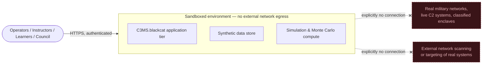
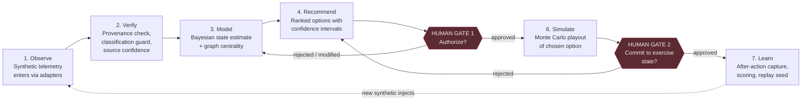
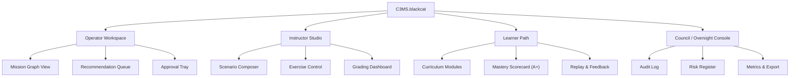
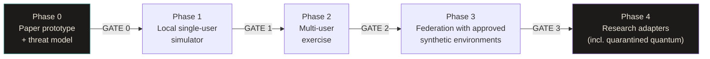

# C3MS.blackcat
### A Design Specification for an Unclassified, Defensive Cyber C2 Simulation, Education & Decision-Support Platform

---

## 0. Title Page

| Field | Value |
|---|---|
| **Concept name** | C3MS.blackcat (working name; "blackcat" is a codename layer, not a claim of Air Force affiliation) |
| **One-sentence definition** | C3MS.blackcat is an unclassified, sandboxed simulation and training environment that lets blue teams, students, and analysts rehearse operational-level cyber command-and-control decision-making — synthetic telemetry in, human-approved recommendations out, nothing live ever touched. |
| **Status** | **CONCEPT / UNBUILT.** This document is a design specification for review and ratification. No code, infrastructure, or deployed system exists. Nothing described here should be represented as operational. |
| **Intended audience** | The commissioning user and the Grand Council (ratification); prospective builders/engineers (design contract); instructors and exercise directors (product fit); students, blue-team trainees, and civilian researchers (end users); ethics/oversight reviewers (risk sign-off) |
| **Relationship to prior work** | Inspired by, but categorically distinct from, the real U.S. Air Force **Cyber Command and Control Mission System (C3MS)** described in the companion C3MS Research Dossier. This concept borrows C3MS's *functional shape* (situational awareness → planning → execution → assessment, synchronizing subordinate systems) as a design metaphor for an educational simulator. It does not access, replicate, or depend on any real Air Force system, data, or authority. |
| **Document type** | Concept design specification (PM feature-spec structure), pre-build |

### Design principles

1. **Sandbox by construction, not by policy.** The system should be architecturally incapable of reaching live networks or real military systems — not merely instructed not to.
2. **Human authority is the product.** Every consequential state transition requires a named human approver. Automation recommends; it never decides.
3. **Provenance before prediction.** No estimate, score, or recommendation is shown without a visible trail to the synthetic data and model version that produced it.
4. **Legible confidence.** Uncertainty is a first-class visual element, not a footnote — false confidence is treated as a defect.
5. **Classical first.** MVP analytics are well-understood, auditable, and boring on purpose. Exotic computation is a quarantined research wing, never a dependency.
6. **Ring, not hierarchy, for resilience — metaphor, not physics.** Redundant circulation paths and no single point of failure are engineering goals; the toroid is a diagram choice, not a physical claim.
7. **Teachable at every layer.** The same system that runs an exercise for a professional blue team also scores a classroom drill — one product, two audiences, shared rigor.
8. **Ratify before you build.** Nothing ships past Phase 0 without an explicit stop/go decision from a named reviewing body.

---

## 1. Name Rationale and Backronym

**"C3MS"** is retained as a nod to the real Air Force program's functional pattern — an operational-level system that synchronizes other systems into a common picture — as documented in the dossier's description of C3MS as the system that "synchronizes the Air Force's other cyber weapon systems to produce operational-level effects" ([ACC C3MS fact sheet](https://www.acc.af.mil/Portals/92/Docs/Fact%20Sheets%20-%202020%20Update/Facts%20Sheets%202022%20Final/C3MS_final.pdf?ver=I9IFxE-kSDRchVrVNGJQOQ==&timestamp=1689265823637)). C3MS.blackcat is an homage to that shape, applied to an unclassified simulation — not a rename, fork, or reimplementation of the real system.

**"blackcat"** does three things at once: it evokes the black/graphite visual identity (§8), it nods to the cat-eye/toroid mark inspired by the ring topology reference image, and it reads as an approachable, slightly irreverent codename appropriate for an educational tool rather than a weapon system.

### Backronym: **BLACKCAT**

| Letter | Word | What it commits the system to |
|---|---|---|
| **B** | **Blue-team** | Purely defensive orientation — incident response, resilience, coordination. No offensive tooling. |
| **L** | **Learning** | Every exercise produces graded, reviewable learning artifacts, not just outcomes. |
| **A** | **Approval-gated** | No recommendation executes without a named human authorizer. |
| **C** | **Command-picture** | A single synthesized situational view (echoing C3MS's common operational picture) built from synthetic sources only. |
| **K** | **Knowledge** | Provenance and confidence travel with every fact and figure. |
| **C** | **Coordination** | Multi-role exercise play across operator, instructor, learner, and oversight seats. |
| **A** | **After-action** | Structured review is a core loop stage, not an afterthought. |
| **T** | **Trust** | Immutable audit, role-based access, and an appeal/override workflow anchor every decision path. |

The backronym is descriptive of behavior the system must exhibit, not decoration — each letter maps to a section of this specification.

---

## 2. Problem Statement, Goals, Non-Goals, Personas, User Stories

### 2.1 Problem statement

Cyber defenders, exercise planners, and students who want to practice operational-level cyber command-and-control decision-making — prioritizing incidents, allocating scarce response capacity, reasoning under uncertainty, and coordinating across roles — have few unclassified, safe, and pedagogically structured environments to do so. Classified C2 systems like the real-world C3MS are, by design and necessity, inaccessible to students, most blue teams, and civilian researchers; the dossier notes C3MS personnel require **TS/SCI clearances and DoD 8570 Level III certifications** and that the system spans **SIPRNet and JWICS** enclaves ([NETCENTS-2 PWS](https://www.netcents.af.mil/Portals/30/documents/NETCENTS-2/NetOpsDocuments/Draft%20PWS/Draft%20PWS%20100-%2027%20Dec%202016.pdf?ver=2017-01-09-094747-717); [FY20 budget PE 0208064F](https://www.dacis.com/budget/budget_pdf/FY20/PROC/F/831010_13.pdf)). Meanwhile, most commercial cyber-range and tabletop tools either focus narrowly on technical exploitation drills (offense-flavored, poor fit for an unclassified/defensive-only mandate) or on generic incident-response checklists (thin on the graph/estimation/optimization reasoning that operational-level C2 actually requires). There is no widely available, rigorously human-gated, synthetic-data-only environment that teaches and exercises the *decision layer* of cyber C2 — the "quarterback" role the dossier attributes to C3MS ([MeriTalk](https://www.meritalk.com/articles/fighting-fire-with-fire-air-forces-cyber-weapons-protect-its-networks/)) — without any of the classification, live-system, or offensive-capability risk.

### 2.2 Goals (outcomes, not outputs)

1. Give learners and blue teams a repeatable way to practice operational-level cyber C2 decision-making and measurably improve decision quality across successive exercises (see §13 metric: decision quality).
2. Make uncertainty and provenance visible by default, reducing false-confidence in exercise outputs (see §13 metric: false-confidence rate).
3. Shorten the time between a synthetic incident's appearance and a coordinated blue-team response inside exercises (see §13 metrics: time-to-detect, time-to-coordinate).
4. Produce a complete, exportable audit trail for every exercise so instructors, oversight bodies, and learners can reconstruct exactly what happened and why (see §13 metric: audit completeness).
5. Establish a curriculum-grade mastery model (the "A+" scoring layer, §6.11) that instructors can trust as a fair, explainable measure of learner progress.

### 2.3 Non-goals (explicitly out of scope)

1. **Not a live operational system.** C3MS.blackcat will never connect to, control, or represent real military networks, sensors, or effects. This is a permanent architectural boundary, not a phase-1 limitation.
2. **Not offensive tooling.** No exploit development, payload delivery, external scanning, or red-team-against-real-targets capability will be built, even as a "future phase."
3. **Not a classified-data system.** No classified, controlled unclassified information (CUI), or real target/asset data will ever be ingested. All telemetry is synthetic or explicitly declassified/public reference data used for narrative flavor only.
4. **Not an autonomous decision-maker.** The system will not be built, in any phase, to execute actions without a human approval gate. Automating targeting or autonomous response is out of scope permanently, not just for MVP.
5. **Not a quantum-computing product.** Quantum methods are, at most, a quarantined research adapter gated by real benchmarks (§9.4) — never a production dependency.
6. **Not a general-purpose cyber range for exploitation practice.** Adjacent but distinct products (e.g., red-team ranges, CTF platforms) are intentionally not this system's job.

### 2.4 Personas

| Persona | Role | Primary need |
|---|---|---|
| **Operator (Exercise Player)** | Blue-team analyst/controller running the mission graph during a live exercise | A trustworthy, legible common picture and recommendations they can accept, modify, or reject quickly |
| **Instructor / Exercise Director** | Designs scenarios, adjudicates outcomes, grades performance | Scenario composition tools, control over injects, visibility into every player action |
| **Learner (Student)** | Individual or team working through curriculum modules | Clear mastery feedback ("A+" style scoring), safe repetition, explainable mistakes |
| **Council / Oversight Reviewer** | Ethics, safety, or governance reviewer auditing the platform and its exercises | Full audit trail, risk register visibility, override/appeal records |
| **Platform Engineer (secondary)** | Builds and maintains the system | Clear module boundaries, no ambient escalation paths, testable acceptance criteria |

### 2.5 Prioritized user stories

1. **P0 — Operator:** As an operator, I want a single synthesized mission picture of the exercise's simulated assets and incidents, so that I can make prioritization decisions without hunting across disconnected tools.
2. **P0 — Operator:** As an operator, I want every recommendation to show its confidence and the evidence behind it, so that I don't act on a false-confident suggestion.
3. **P0 — Instructor:** As an instructor, I want to compose a scenario from a library of synthetic telemetry patterns and injects, so that I can build a training exercise without writing code.
4. **P0 — Council reviewer:** As an oversight reviewer, I want an immutable, exportable audit log of every decision, override, and approval in an exercise, so that I can verify the system behaved within its authorized boundary.
5. **P1 — Learner:** As a learner, I want a mastery score that explains which specific skills I demonstrated or missed, so that I know what to practice next.
6. **P1 — Operator:** As an operator, I want to run a Monte Carlo resilience test against a candidate response plan before committing to it, so that I can compare options under uncertainty.
7. **P1 — Instructor:** As an instructor, I want to pause, replay, and branch an exercise, so that I can show alternate outcomes for the same decision point.
8. **P2 — Operator:** As an operator, I want to override a recommendation and record my rationale, so that my judgment is preserved for after-action review rather than silently discarded.
9. **P2 — Learner:** As a learner in a team exercise, I want to see (post-exercise) how my role's decisions affected teammates' options, so that I understand cross-role coordination costs.
10. **P2 — Platform engineer:** As a platform engineer, I want every module to declare its data classification boundary in a manifest, so that CI can reject any change that would let synthetic and real/classified data mix.

---

## 3. System Architecture

### 3.1 Architectural narrative

C3MS.blackcat is organized as a **logical ring of cooperating services around a shared mission graph**, rather than a single top-down pipeline. The ring metaphor — inspired loosely by the toroidal visualization supplied as a reference (see §17) — is used here strictly to describe two engineering properties, not physics:

- **Circulation, not a single critical path.** Data and decisions can flow through the loop in either direction and any single service can be degraded without stopping the whole loop, because each stage both consumes and produces shared state through the mission graph rather than through a single upstream dependency.
- **Redundant re-entry points.** Any stage can be re-triggered from any other stage's output (e.g., After-Action Learning can re-inject a scenario directly into Verify without transiting the full loop), giving the system multiple recovery paths after a fault — logical redundancy, not an exotic energy or force-field claim.

No claim is made about physical toroidal geometry, energy recirculation, or novel physics; the ring is a control-flow and resilience diagram convention only.

### 3.2 Mermaid: core system architecture

```mermaid
flowchart TB
    subgraph RING["Logical ring — mission graph as shared hub, redundant circulation"]
        direction LR
        A["Synthetic Telemetry\nAdapters"] --> B["Scenario\nComposer"]
        B --> C["Mission / Asset\nGraph (hub)"]
        C --> D["Evidence &\nProvenance Store"]
        D --> E["Probabilistic State\nEstimator"]
        E --> F["Resilience & Scenario\nEngine (Monte Carlo)"]
        F --> G["Recommendation\nLayer"]
        G --> H["Ethics / Authority\nGate"]
        H --> I["Exercise\nControl"]
        I --> C
        I --> J["After-Action\nLearning"]
        J --> B
        J --> C
    end

    K["Curriculum / A+\nMastery Scoring"] -.reads.-> D
    K -.reads.-> J
    L["Audit / Export"] -.reads all.-> D
    L -.reads all.-> H
    L -.reads all.-> I

    M(["Human Approver"]) ==gate==> H
    N(["Instructor"]) --composes--> B
    O(["Operator"]) --plays--> I
    P(["Council / Oversight"]) --reviews--> L

    style RING fill:#111417,stroke:#2f3a3a,stroke-width:1px
    style H fill:#5b2a33,stroke:#a13544,color:#f5f0e6
    style M fill:#20808d,stroke:#0c4e54,color:#0d1210
```

**Reading the diagram:** the inner ring (A→J) is the core loop (detailed in §4). The **Ethics / Authority Gate (H)** is deliberately drawn as a chokepoint on the ring — every path to Exercise Control passes through it, and it cannot be bypassed by any other module. The **Mission/Asset Graph (C)** is the shared hub all stages read and write, which is what enables re-entry from multiple points rather than forcing strict linear order. **Audit/Export** and **Curriculum Scoring** are drawn outside the ring because they are read-only observers of it — they can never write into the loop, which is intentional: grading and auditing must not be able to influence the exercise they are grading.

### 3.3 Deployment boundary

The crossed-out connections in §3.3 are not a future roadmap item to relax — they are a permanent boundary restated at every phase gate in §12.

---

## 4. Core Loop

**Observe → Verify → Model → Recommend → Authorize → Simulate → Learn**, with explicit human approval gates at two points.

- **Observe:** synthetic telemetry adapters emit events into the mission graph; nothing here is a real sensor.
- **Verify:** every incoming fact is checked for provenance completeness and classification guard status before it is allowed to influence state (§7).
- **Model:** the probabilistic state estimator updates belief state; graph centrality flags which assets matter most right now.
- **Recommend:** the recommendation layer proposes ranked options with visible confidence — never a single "the answer."
- **Authorize (Gate 1):** a named human must approve, modify, or reject before any option proceeds to simulation. Rejection loops back to Model with the operator's feedback attached.
- **Simulate:** the resilience/scenario engine plays out the approved option via Monte Carlo trials inside the sandbox — still no effect on anything outside it.
- **Authorize (Gate 2):** a second, distinct human checkpoint commits the simulated outcome into the exercise's canonical state (prevents a single approver from both choosing and finalizing an action unchecked).
- **Learn:** after-action capture stores the full decision trace, feeds curriculum scoring, and can seed new synthetic injects — closing the loop back to Observe.

---

## 5. Modules

| # | Module | Purpose | Notes |
|---|---|---|---|
| 5.1 | **Synthetic Telemetry Adapters** | Generate/import synthetic network, asset, and incident events; each event carries a synthetic-data tag and generator ID | No adapter may connect to a live external network. Real public reference data (e.g., anonymized/declassified case studies) may season scenarios but is clearly labeled and never treated as ground truth about a real live system |
| 5.2 | **Scenario Composer** | No-code/low-code authoring of exercises: asset inventories, inject timelines, victory/failure conditions, role assignments | Instructor-facing; supports branching and templated libraries |
| 5.3 | **Mission / Asset Graph** | Canonical, versioned graph of synthetic assets, dependencies, and incidents — the shared hub of the ring | Every node/edge carries provenance and confidence metadata |
| 5.4 | **Evidence / Provenance Store** | Immutable store of source, timestamp, generator, and confidence for every fact entering the graph | Append-only; feeds audit and the classification guard |
| 5.5 | **Probabilistic State Estimator** | Bayesian filtering over the mission graph to maintain a belief state (e.g., "likelihood this synthetic host is compromised") | Classical statistics only for MVP (§9) |
| 5.6 | **Resilience / Scenario Engine** | Monte Carlo scenario testing and graph-centrality analysis to evaluate "what if" response options and structural resilience (ring-style redundancy, no single point of failure) | This is where the ring/toroid metaphor becomes an actual analytic: circulation and redundancy are measured as graph properties, not simulated as physics |
| 5.7 | **Recommendation Layer** | Constraint optimization over response options (limited analyst-hours, limited containment actions) producing ranked, explainable suggestions | Always outputs confidence + rationale + top alternative |
| 5.8 | **Ethics / Authority Gate** | Enforces human-approval checkpoints, role permissions, and the classified/live-system exclusion boundary before any state-changing action commits | Cannot be bypassed by any other module (§3.2) |
| 5.9 | **Exercise Control** | Runs, pauses, branches, and replays live exercise sessions; manages multi-role turn state | Instructor override always available |
| 5.10 | **After-Action Learning** | Captures full decision traces, generates structured after-action review reports, and produces new synthetic injects for future scenarios | Read/write into the loop (feeds Scenario Composer and Mission Graph) |
| 5.11 | **Curriculum / A+ Mastery Scoring** | Maps demonstrated decisions to skill rubrics; produces explainable, per-skill mastery scores (the "A+" layer) | Read-only observer of the loop (§3.2); never influences exercise outcomes |
| 5.12 | **Audit / Export** | Immutable, exportable log of every observation, model output, recommendation, approval/override, and score | Read-only observer; supports Council/oversight export formats |

---

## 6. Data Model and Trust Model

### 6.1 Core entities

| Entity | Key attributes |
|---|---|
| **SyntheticEvent** | id, generator_id, timestamp, payload, source_confidence, classification_tag (always `UNCLASSIFIED-SYNTHETIC`) |
| **MissionGraphNode / Edge** | id, type (asset/incident/dependency), state belief (probability distribution), last_updated_by (model version), provenance_refs |
| **Recommendation** | id, options[], confidence_interval, rationale, model_version, generated_at, superseded_by |
| **ApprovalRecord** | gate_id, approver_role, approver_id (pseudonymous), decision (approve/modify/reject), rationale_text, timestamp |
| **AuditEntry** | actor, action, target_entity, before_state_hash, after_state_hash, timestamp — append-only |
| **MasteryScore** | learner_id (pseudonymous), rubric_skill, score, evidence_refs, exercise_id |
| **ModelLineage** | model_id, version, training/config description, benchmark results, deprecation_status |

### 6.2 Trust model pillars

1. **Provenance:** Every fact traces to a `SyntheticEvent` and generator ID. Facts without provenance cannot enter the Mission Graph (enforced at Verify, §4).
2. **Confidence:** Every model output (state estimate, recommendation, resilience score) carries an explicit confidence interval or calibrated probability — never a bare point estimate.
3. **Classification guard:** A hard software gate that inspects every inbound and outbound payload for classification markings or patterns resembling real sensitive data, and rejects/quarantines anything that is not tagged `UNCLASSIFIED-SYNTHETIC`. This is a defense-in-depth control, not a substitute for the architectural exclusion of classified ingestion (§2.3).
4. **Role-based access control (RBAC):** Operator, Instructor, Learner, and Council roles have distinct, least-privilege permissions; no role can silently gain another's authority.
5. **Immutable audit log:** Append-only, cryptographically hash-chained log of every state-changing action; visible in full to Council/oversight roles and in redacted form to learners.
6. **Model / version lineage:** Every recommendation and estimate is stamped with the exact model version and configuration that produced it, so results are reproducible and reviewable after the fact.
7. **Appeal / override workflow:** Any human approver may override a recommendation; the override, its rationale, and the original recommendation are all preserved (never overwritten) so after-action review sees the full decision context. A structured appeal path lets a learner or operator flag a scoring or recommendation decision for instructor/Council re-review.

---

## 7. Product Experience and Information Architecture

### 7.1 Views by persona

- **Operator View:** mission graph map, live recommendation queue, approval gate tray, resilience test sandbox. Optimized for fast, legible triage under simulated time pressure.
- **Instructor View:** scenario composer canvas, inject timeline, live exercise control panel (pause/branch/replay), grading dashboard.
- **Learner View:** guided curriculum modules, personal mastery scorecard ("A+" skill breakdown), replay of own decisions with annotated feedback.
- **Council / Oversight View:** audit log browser, risk register, override/appeal queue, aggregate metrics dashboard (§13), export tools.

### 7.2 Information architecture (top-level)

### 7.3 Visual identity

A restrained identity derived from the references, deliberately avoiding any real brand's trade dress:

| Token | Value (approx.) | Role | Reference influence |
|---|---|---|---|
| Graphite / near-black | `#14151A` | Primary background | Dark field of the toroid and quantum infographic references — used as neutral canvas, not for drama |
| Bone | `#EDE7DA` | Primary text / high-contrast surface | Approachability cue from the storefront reference's clean white signage, without copying its layout or marks |
| Sea-glass teal | `#3F8E8A` | Primary UI accent (navigation, active states, links) | A calmer, desaturated cousin of the toroid's cyan/teal bands — used sparingly as *the* accent, not decoratively |
| Spectral accent (state-transition only) | shifting hue across `#7B5EA7` (violet) → `#3F8E8A` (teal) → `#C97B3D` (amber) | **Reserved exclusively** for animating state transitions (e.g., a gate approval firing, a recommendation superseding another) | Drawn from the multi-hue banding of the toroid image — used as a motion/eventing signal, never as a static UI color, so it stays meaningful |
| Muted graphite-blue | `#2B2F36` | Secondary surfaces / cards | Neutral support tone |
| Signal red (semantic only) | `#A13544` | Errors, rejected gates, high risk | Standard semantic red — not derived from references, used only for genuine warnings |

**Mark:** an abstract **cat-eye / toroid mark** — a single elliptical ring with a slit-pupil negative space, suggesting both watchfulness (cat-eye, echoing C3MS's situational-awareness role) and circulation (open ring, echoing the toroid reference). The mark is line-based, single-color, and geometric — it does not depict a literal animal, storefront signage, or any real quantum-hardware diagram, and must not resemble any existing service mark.

**Typography:** two-font system per design-foundations guidance — a clean geometric sans for headings (e.g., Space Grotesk or system equivalent) and a highly legible sans for body/data (e.g., Inter). No serif; this is an operational/data product, not an editorial one. Numeric displays (confidence intervals, scores) use tabular figures.

**What was deliberately avoided:** any red-marker "A+" grade-stamp treatment, any storefront-style photo collage, any literal rainbow gradient across full surfaces, and any hardware-diagram iconography (vacuum chambers, cryogenic stages, qubit spheres) — all of which belong to the reference images' literal subject matter, not to this product's identity. See §17 for the full reference-interpretation appendix.

---

## 8. Classical Analytics for MVP (and the Quarantined Quantum Question)

MVP analytics are entirely classical, well-understood, and independently auditable:

| Technique | Used for | Why classical is sufficient |
|---|---|---|
| **Bayesian filtering** | Updating belief about synthetic asset/incident state as new synthetic events arrive | Mature, explainable, works well at exercise scale (dozens–hundreds of nodes) |
| **Graph centrality** | Identifying which synthetic assets are structurally critical (informs the "ring resilience" framing in §5.6) | Standard graph theory; no need for exotic computation at this scale |
| **Monte Carlo scenario testing** | Estimating outcome distributions for candidate response plans | Directly supports uncertainty visualization; trivially parallelizable on commodity compute |
| **Constraint optimization** | Allocating limited analyst-hours/response actions across competing incidents | Well-suited to linear/integer programming solvers; explainable trade-offs |
| **Calibration** | Checking that stated confidence intervals match observed outcomes across exercises | Essential to the false-confidence-rate metric (§13) |
| **Uncertainty visualization** | Displaying confidence bands, not just point estimates, throughout the UI | Core to the "legible confidence" design principle (§0) |

### 8.1 Optional quantum adapter — quarantined research interface

A quantum computing adapter is **explicitly not part of the MVP or any committed roadmap phase.** If pursued at all, it must be:

- **Quarantined:** a separate research module with no read/write path into the production mission graph, recommendation layer, or any exercise a real learner or operator is scored on.
- **Benchmark-gated:** only advanced from research to even an opt-in experimental status if a documented, reproducible benchmark shows a *real, measured* advantage over the classical baseline on a stated task — not a theoretical speedup claim.
- **Non-dependency:** the platform must fully function, forever, with the quantum adapter absent, disabled, or removed.

This directly reflects the caution flagged for the quantum-infographic reference image (§17): the infographic is treated as a *layered control-stack and computation-cycle* inspiration for how the core loop is diagrammed (initialize → control → interact → measure, echoed loosely in Observe → Verify → Model → Recommend), not as evidence that quantum hardware belongs in this product.

---

## 9. Ethics, Safety, Privacy, Civil Liberties, Dual-Use, and Misuse Controls

### 9.1 Governing constraints

- **No live-system control, ever.** Restated as a permanent, non-negotiable architectural boundary (§2.3, §3.3).
- **No offensive capability.** No exploit generation, payload crafting, or scanning of real external networks, in any phase.
- **No classified or real sensitive data ingestion.** Enforced by the classification guard (§6.2) plus a standing policy prohibition.
- **No autonomous action.** Every consequential transition requires a named human approver (§4).
- **Civil-liberties guardrail on monitoring-flavored content.** Because the real C3MS synchronizes systems that include OPSEC-style monitoring of unclassified communications ([Air University](https://www.airuniversity.af.edu/Portals/10/ASPJ/journals/Volume-27_Issue-5/SLP-Skinner.pdf)), any scenario content that simulates monitoring of communications must use synthetic personas only, must never model real identifiable individuals, and must be reviewed for whether it could normalize inappropriate domestic-surveillance framing in training material.
- **Dual-use awareness.** Blue-team training content (attack patterns, incident narratives) is inherently dual-use — the same knowledge that trains defenders could inform an attacker. Mitigate via: synthetic-only scenario content, no step-by-step exploit detail, instructor-gated access to advanced scenario libraries, and export controls on scenario packs.
- **Misuse of scoring.** Mastery scores and audit logs contain performance data on real people; treat as sensitive personal data even though the exercise content is synthetic (pseudonymize learner IDs, minimize retention, restrict export).

### 9.2 Risk register (severity × likelihood, 1–5 scale each; residual risk assessed after listed mitigations)

| # | Risk | Severity | Likelihood | Score | Level | Mitigation | Residual | Owner |
|---|---|---|---|---|---|---|---|---|
| R1 | Scope creep toward live-system connectivity ("just this once, point it at a real feed") | 5 | 2 | 10 | ORANGE | Hard architectural air-gap (§3.3); code-level rejection of non-synthetic-tagged data; change-control requiring Council sign-off for any network-egress feature | 5 (LOW-MED) | Platform Engineering Lead |
| R2 | Scenario content normalizes offensive/exploit tradecraft | 4 | 3 | 12 | ORANGE | Content review checklist bans step-by-step exploit detail; instructor-gated advanced libraries; periodic content audit | 6 (MED) | Instructor Content Board |
| R3 | Classification guard fails to catch a mismarked or accidentally-real sensitive input | 5 | 2 | 10 | ORANGE | Defense-in-depth: guard at ingestion + guard at export + manual spot audits + adapter allow-listing (only approved synthetic generators) | 5 (LOW-MED) | Security/Compliance Owner |
| R4 | Over-trust in recommendations despite stated uncertainty (automation bias) | 4 | 4 | 16 | RED | Mandatory display of confidence + alternatives; calibration tracking exposed to operators; two-gate approval (§4); training module on automation bias | 8 (MED) | Product/UX Lead |
| R5 | Learner personal performance data (mastery scores) mishandled or over-retained | 3 | 3 | 9 | YELLOW | Pseudonymized learner IDs; documented retention schedule; RBAC restricting export; privacy review before Phase 2 | 4 (LOW) | Privacy Owner |
| R6 | Audit log tampering or gaps undermine after-action trust | 5 | 2 | 10 | ORANGE | Hash-chained append-only log; independent audit-export path (§5.12) that cannot be modified by exercise-control roles | 4 (LOW) | Security/Compliance Owner |
| R7 | Quantum adapter (if pursued) becomes a de facto dependency via convenience/hype rather than benchmark evidence | 3 | 2 | 6 | YELLOW | Governance rule requiring published benchmark before any promotion out of quarantine (§8.1); architectural isolation | 3 (LOW) | Research Lead |
| R8 | Misrepresentation of the product as operational or government-affiliated | 4 | 3 | 12 | ORANGE | "CONCEPT/UNBUILT" and "not a real Air Force system" banners in-product and in all docs; no use of real service marks or seals | 4 (LOW) | Product Lead |
| R9 | Instructor over-override erodes exercise realism or fairness across cohorts | 2 | 3 | 6 | YELLOW | Override logging + pattern review in after-action analytics; instructor calibration guidelines | 3 (LOW) | Instructor Content Board |
| R10 | Federation (Phase 3) exposes one organization's scenario data to another without consent | 4 | 2 | 8 | YELLOW | Federation opt-in per scenario pack; data-sharing agreement template; per-partner access scoping | 4 (LOW) | Partnerships/Legal Owner |

Risks scoring ORANGE or RED (R1, R2, R3, R4, R6, R8) require go/no-go review before the phase in which they become live (see §12 stop/go gates); all entries remain in the register post-mitigation for periodic re-review, consistent with treating "accepted" risk as still requiring monitoring.

---

## 10. Requirements (P0/P1/P2) with Acceptance Criteria

### P0 — Must have

**P0-1. Sandbox isolation.**
- *Given* the system is deployed in any environment, *when* any component attempts an outbound connection to a non-allow-listed host, *then* the connection is blocked and logged as a security event.

**P0-2. Synthetic-only data ingestion.**
- *Given* an inbound event lacks an `UNCLASSIFIED-SYNTHETIC` tag from an allow-listed generator, *when* it reaches the Verify stage, *then* it is rejected and quarantined, not admitted to the Mission Graph.

**P0-3. Human approval gate before state-changing action.**
- *Given* a recommendation has been generated, *when* no human approver has approved it, *then* the system takes no state-changing action on the mission graph or exercise state.

**P0-4. Confidence display.**
- *Given* any model output (estimate, recommendation, resilience score) is shown to a user, *when* it renders, *then* it includes a visible confidence interval or calibrated probability, not a bare point value.

**P0-5. Immutable audit log.**
- *Given* any state-changing action occurs (approval, override, exercise commit), *when* it is recorded, *then* it is appended to a hash-chained log that no user role can edit or delete.

**P0-6. Override preserves original recommendation.**
- *Given* an operator overrides a recommendation, *when* the override is recorded, *then* both the original recommendation and the override rationale remain retrievable in after-action review.

### P1 — Should have

**P1-1. Scenario composer without code.**
- *Given* an instructor with no programming background, *when* they use the Scenario Composer, *then* they can assemble a runnable exercise (assets, injects, timeline, win/loss conditions) without writing code.

**P1-2. Mastery scorecard explainability.**
- *Given* a learner completes an exercise, *when* they view their mastery scorecard, *then* each skill score links to the specific decisions/evidence that produced it.

**P1-3. Monte Carlo resilience test before commit.**
- *Given* an operator has a candidate response option at Gate 1, *when* they request a resilience test, *then* the system returns an outcome distribution (not a single number) within the session before the operator must decide.

**P1-4. Replay and branch.**
- *Given* a completed or in-progress exercise, *when* an instructor selects a decision point, *then* they can branch a new exercise instance from that point without altering the original record.

### P2 — Could have

**P2-1. Cross-role after-action visualization.**
- *Given* a multi-role exercise has concluded, *when* a learner views after-action review, *then* they can see (in aggregate, role-scoped form) how their decisions affected other roles' available options.

**P2-2. Appeal workflow for scoring.**
- *Given* a learner disputes a mastery score, *when* they file an appeal, *then* an instructor receives the original evidence and rationale and can affirm, adjust, or annotate the score with a recorded justification.

**P2-3. Federated scenario sharing (design-only for MVP; see Phase 3).**
- *Given* two approved partner organizations wish to share a scenario pack, *when* a share is initiated, *then* both parties must separately confirm opt-in and scope before any data becomes visible to the other party.

---

## 11. Phased Build with Stop/Go Gates

| Phase | Scope | Stop/Go gate criteria (Council or designated reviewer must confirm before proceeding) |
|---|---|---|
| **Phase 0 — Paper prototype & threat model** | Wireframes, data model, full threat model, risk register (§9.2) drafted and reviewed; no running code | **GATE 0:** Threat model reviewed; all RED/ORANGE risks have assigned owners and mitigation plans; ratified design spec exists (this document). Go only if the sandbox-isolation and no-live-data boundaries are unanimously accepted as non-negotiable. |
| **Phase 1 — Local single-user simulator** | Single-user, single-machine build: mission graph, synthetic adapters, Bayesian estimator, basic recommendation layer, one approval gate, local audit log | **GATE 1:** P0 acceptance criteria (§10) pass in local testing; classification guard demonstrated rejecting non-synthetic input in a red-team-style internal test; no network egress observed in a monitored trial run. |
| **Phase 2 — Multi-user exercise** | Multi-role sessions (operator/instructor/learner), Exercise Control, After-Action Learning, Curriculum/A+ scoring, full two-gate approval flow | **GATE 2:** Multi-role RBAC tested for privilege-escalation gaps; audit log integrity verified under concurrent multi-user load; privacy review of mastery-score handling (R5) completed; a real pilot cohort completes at least one full exercise with after-action review produced. |
| **Phase 3 — Federation with approved synthetic environments** | Controlled scenario/result sharing across separately administered instances (e.g., partner schools or teams), opt-in per pack | **GATE 3:** Per-partner data-sharing agreements executed; federation opt-in/scoping tested (P2-3); no cross-tenant data leakage in adversarial test; legal/privacy sign-off. |
| **Phase 4 — Research adapters** | Quarantined research interfaces (e.g., experimental optimization methods; optional quantum adapter) with no production dependency | **GATE 4 (per-adapter):** A documented, reproducible benchmark shows measured advantage over the classical baseline for a specific task; adapter remains architecturally isolated from production paths (§8.1); Council review of dual-use implications for the specific technique. |

No phase may be skipped, and any phase can be halted and rolled back to the prior phase's gate if a RED risk materializes.

---

## 12. Metrics

All targets below are **proposed, not measured** — there is no existing deployment to draw a baseline from. Each metric's first job in Phase 1–2 is to *establish* a baseline; only after a baseline exists should numeric targets be treated as commitments.

| Metric | Definition | Proposed target (labeled as proposed) | Why it matters |
|---|---|---|---|
| **Decision quality** | Rubric-scored alignment between operator decisions and the best available synthetic ground truth at time of decision, adjusted for information available | *Proposed:* establish baseline in Phase 1 pilot; no numeric target set pre-baseline | Core measure of whether the tool improves reasoning, not just throughput |
| **False-confidence rate** | Share of high-stated-confidence recommendations/estimates that were subsequently wrong, from calibration tracking (§8) | *Proposed:* trend toward well-calibrated (observed accuracy ≈ stated confidence); no fixed numeric target pre-baseline | Directly targets automation-bias risk (R4) |
| **Provenance completeness** | Share of facts in the mission graph with complete, valid provenance chains | *Proposed:* 100% by construction (facts without provenance should be architecturally impossible to admit, per P0-2) — this one target is a design invariant, not a statistical goal | Trust model backbone (§6) |
| **Time-to-detect** | Elapsed simulated time between a synthetic incident's first observable signal and its correct identification in-exercise | *Proposed:* baseline in Phase 1–2; track improvement across successive exercises per cohort | Reflects situational-awareness effectiveness |
| **Time-to-coordinate** | Elapsed time between detection and a cross-role, approved response plan in multi-user exercises | *Proposed:* baseline in Phase 2 pilot | Directly measures the multi-role coordination value proposition |
| **Exercise learning gain** | Pre/post mastery-score delta for learners across a curriculum module | *Proposed:* establish baseline per cohort; no fixed target pre-baseline | Validates the curriculum/A+ scoring module's core promise |
| **Override rate** | Share of recommendations that human approvers modify or reject at Gate 1/Gate 2 | *Proposed:* track trend; neither "too high" nor "too low" is automatically good — used diagnostically, paired with override rationale review (R9) | Signals whether recommendations are well-calibrated to real operator judgment |
| **Audit completeness** | Share of state-changing actions with a complete, hash-verified audit entry | *Proposed:* 100% by construction (P0-5 is a design invariant) | Foundational to Council trust and after-action integrity |

---

## 13. Technical Stack Suggestion (Unclassified Prototype, No Code)

This is a suggested category-level stack for a Phase 0–2 unclassified prototype. No specific proprietary product is mandated; choices should favor open, well-audited, boring technology over novelty.

| Layer | Suggested category | Rationale |
|---|---|---|
| **Frontend** | Component-based web application framework, served over authenticated HTTPS only | Cross-platform access for operator/instructor/learner/council views; no native client needed for a sandboxed web tool |
| **API / application tier** | Statically-typed backend service framework with strict schema validation at every boundary | Schema validation is the first-line enforcement of the classification guard and synthetic-only ingestion (P0-2) |
| **Mission graph store** | Property-graph database | Natural fit for asset/dependency/incident relationships and centrality analysis (§5.6) |
| **Evidence / provenance & audit store** | Append-only log store with cryptographic hash chaining | Matches the immutable-audit-log requirement (P0-5) directly |
| **Probabilistic modeling** | Established open-source Bayesian/statistical computing libraries | Mature, auditable, widely peer-reviewed — no need for bespoke statistical code |
| **Monte Carlo / simulation compute** | Batch/parallel compute cluster (containerized), isolated from the live application tier | Resilience testing (§5.6) is compute-bursty and should not share a fault domain with the live UI |
| **Constraint optimization** | Standard open-source linear/integer programming solver | Adequate for the scale of an exercise-level resource-allocation problem |
| **Identity / RBAC** | Standards-based identity provider (e.g., OpenID Connect) with role claims mapped to the four personas | Keeps auth logic out of application code, easier to audit |
| **Deployment boundary** | Fully air-gapped or default-deny-egress container environment; explicit allow-list only for internal service-to-service traffic | Directly implements the sandbox isolation requirement (P0-1, §3.3) |
| **Research adapter sandbox (Phase 4)** | Fully separate compute environment with its own network policy, no production data access | Enforces the quarantine requirement for optional quantum/experimental adapters (§8.1) |

---

## 14. Grand Council Review

*Each seat renders a concise critique. Interpretive judgments are the analyst's own, grounded in this design document and the underlying dossier where cited.*

1. **Historian / Philosopher:** This concept deliberately inverts the real C3MS's arc — where the companion C3MS Research Dossier, §2, traces AFNOSC → C3MS → joint cloud C2 as a story of institutional consolidation and rising classification, C3MS.blackcat moves the opposite direction: toward openness, pedagogy, and unclassified accessibility. That inversion is the concept's entire reason to exist and should be stated plainly in any public description.
2. **Physicist:** The toroidal reference image is correctly treated here as a diagram convention for redundant circulation, not a physical mechanism — the design document is explicit that no exotic energy or field claim is being made (§3.1). This restraint should be preserved verbatim in any future marketing material; the temptation to over-claim "toroidal architecture" as a technical differentiator should be resisted.
3. **Engineer:** The ring-as-hub-and-spoke pattern (§3.2) is sound and buildable with ordinary distributed-systems practice; the harder engineering problem is not the topology but enforcing the sandbox boundary (P0-1) under real network complexity — recommend the Phase 1 gate include an actual adversarial network-egress test, not just a design review.
4. **Mathematician:** The classical analytics stack (§8) is appropriately conservative — Bayesian filtering, centrality, Monte Carlo, and constraint optimization are all well-suited to exercise-scale graphs and will be far easier to calibrate and validate than any quantum claim; the benchmark-gate condition on the quantum adapter (§8.1) is the correct discipline and should not be weakened under enthusiasm.
5. **Skeptic:** The name "C3MS" invites confusion with the real Air Force program despite the disclaimers; recommend the product's public-facing materials lead with "not affiliated with, and does not replicate, any U.S. government system" even more prominently than this document does, given the companion C3MS Research Dossier's own finding, in §1, that similarly-named systems (C3BM, CMCC, JCC2) are already routinely conflated.
6. **Emperor / Decision:** Approve the design for Phase 0 (paper prototype and threat model) proceeding to Phase 1 pilot, contingent on the ORANGE/RED risk owners in §9.2 being named real individuals or roles before any code is written, and on the sandbox-isolation test in Gate 1 being non-negotiable.
7. **Conscience / Ethics:** The two-gate human approval design and the explicit ban on autonomous action are the document's strongest ethical commitments and must never be "optimized away" for exercise speed in later phases; recommend adding a standing rule that no future feature request may reduce the number of human gates below two for any state-changing action.
8. **Strategist:** Positioning this as education/decision-support rather than as a training analog to a weapon system is the right call commercially and reputationally — it opens civilian, academic, and cross-sector blue-team markets that a defense-only framing would foreclose.
9. **Operator:** The Operator View's emphasis on a fast recommendation queue with visible confidence is the right UX bet; recommend usability testing specifically for how quickly an operator can distinguish "high confidence, act now" from "low confidence, gather more evidence" at a glance, since this is where false-confidence risk (R4) will actually surface.
10. **Archivist / Scribe:** The audit/export module's read-only, non-writeback design (§3.2, §5.12) is the correct pattern for preserving after-the-fact reviewability; recommend the audit export format be specified early (even before Phase 1 code) so Council review tooling can be built in parallel rather than retrofitted.
11. **Outsider:** To a newcomer, "BLACKCAT" and "toroid" both sound more exotic than the underlying product (a classroom-friendly, human-gated exercise simulator); recommend early user-testing of the name and visual identity with non-specialist learners to confirm it reads as approachable rather than intimidating — echoing the Mathnasium reference's "approachable instruction" cue that motivated the bone/teal palette.
12. **Red Team:** The single most likely real-world failure mode is not a dramatic breach but slow scope creep — a well-meaning integration request to "just pipe in one real read-only feed for realism" that erodes the sandbox boundary one exception at a time; recommend the change-control rule in R1's mitigation be enforced by process (Council sign-off required) rather than left to engineering discretion alone.
13. **Computer / 13th Chair:** This design is internally consistent, appropriately conservative on classical-vs-quantum claims, and correctly separates grading/audit from the decision loop it observes. Its main open risk is organizational rather than technical: whether the stop/go gates in §12 will actually be honored under schedule pressure once a real Phase 1 pilot starts. Recommend the Council revisit Gate 1 explicitly, in person, before any Phase 1 code review — not merely as a checkbox.

### Ratifiable Council verdict

**PROPOSED FOR RATIFICATION:** The Grand Council finds the C3MS.blackcat design sound as an unclassified, defensive, human-gated simulation and education concept, clearly bounded away from the real Air Force C3MS system it takes inspiration from, and appropriately conservative in its analytics and phasing claims. Ratification is recommended **conditional on**: (a) named owners for all ORANGE/RED risk-register items before Phase 0 exit, (b) the sandbox-isolation and two-human-gate commitments being treated as permanent architectural invariants rather than phase-1 conveniences, and (c) no public-facing claim that the system exists, is deployed, or is affiliated with any government entity until it actually does, is, or is. This document itself makes no such claim and should remain the reference text against which any future claim is checked.

---

## 15. Open Questions and 10 Prioritized Next Actions

### Open questions

- Who is the accountable Council/oversight body in practice — an internal review board, an external ethics advisor, or the commissioning user acting as sole ratifier?
- What is the intended first deployment context — a classroom, a corporate blue team, a hobbyist/self-study audience, or several simultaneously — since this materially affects Phase 1 scenario content and the curriculum rubric design?
- Should the "A+" mastery-scoring nomenclature be kept, softened, or replaced once real learners see it, given it directly echoes the Mathnasium reference's grading language?
- What retention period is appropriate for learner mastery data and exercise logs, and who is the data controller?
- Is there any interest in eventually seeking independent security/privacy review or certification before Phase 2 multi-user pilots involve real external users?

### 10 prioritized next actions

1. Name accountable owners (real individuals or roles) for every ORANGE/RED item in the risk register (§9.2) before any Phase 0 work is considered complete.
2. Ratify or amend this design document explicitly (§14 verdict) with the actual commissioning stakeholder(s).
3. Draft the Phase 0 threat model in full detail (attacker/misuse-actor models, not just the summary risk register here).
4. Build wireframes for the four persona views (§7.1) to pressure-test the information architecture before any backend work starts.
5. Define the exact schema for `SyntheticEvent`, `MissionGraphNode/Edge`, and `AuditEntry` (§6.1) so the classification guard and audit log can be implemented consistently from day one.
6. Select and document the specific open-source libraries/frameworks for the Bayesian estimator, graph store, and constraint solver referenced in §13.
7. Design the Gate 1 network-egress adversarial test that must pass before Phase 1 exit (per §12).
8. Draft the initial curriculum rubric for the A+ mastery scoring module, including which skills map to which exercise decision points.
9. Draft a one-page public-facing disclaimer ("not a real or affiliated government system; concept/unbuilt") for use in any future demo, pitch, or documentation, per the Skeptic and Emperor critiques in §14.
10. Identify a candidate pilot cohort (e.g., a specific classroom, team, or volunteer group) for the Phase 1 single-user simulator so Phase 2 design can be grounded in real user feedback rather than assumption.

---

## 16. Appendix — Reference Interpretation

This appendix states exactly how each user-supplied image informed the design, and what was deliberately **not** inferred from it. These images are local user uploads, not web sources, and are cited here only by their local filenames/descriptions per the task instructions — no external URL is implied or asserted for them.

### 16.1 Mathnasium storefront (IMG_0083.jpeg)

**What it is:** A photograph of a Mathnasium "Math Learning Center" storefront, featuring a large hand-drawn-style red "A+" mark, "Open" signage, community-partner badge, and window copy about confidence and customized instruction for grades 1–12.

**How it influenced the design:**
- The **"A+" grading language** directly inspired the naming of the **Curriculum / A+ Mastery Scoring module (§5.11)** as an explainable, per-skill mastery score rather than a single pass/fail outcome.
- The storefront's tone of **approachable, visible, community-facing instruction** informed the **bone/teal palette choice (§7.3)** — favoring a legible, non-intimidating visual identity over a harsh military or hacker aesthetic, and the design principle that "the same system... also scores a classroom drill" (§0, principle 7).
- The **"Confidence in Math. Confidence for Life."** messaging pattern informed the emphasis throughout this document on visible, calibrated confidence as a design principle (§0 principle 4; §8 uncertainty visualization; §13 false-confidence-rate metric) — translating "confidence" from a marketing phrase into an engineering requirement (calibration, stated intervals).

**What was deliberately not inferred:**
- No Mathnasium trademark, logo, color scheme, layout, or the specific red-marker "A+" graphic treatment was copied. The visual identity in §7.3 explicitly avoids a literal grade-stamp treatment.
- No claim is made that C3MS.blackcat is affiliated with, endorsed by, or modeled organizationally on Mathnasium or any tutoring franchise.
- The "grades 1–12" framing was not treated as a literal audience constraint; C3MS.blackcat's learner persona spans students through professional blue-team trainees.

### 16.2 "Super Toroid" visualization (IMG_0082.jpeg)

**What it is:** A colorful, mathematically-parameterized ring/toroid visualization (captioned "Super Toroid," with an explicit supertoroid parametric formula) shared on a social platform, showing a twisted, multi-band, symmetric ring structure with rainbow shading.

**How it influenced the design:**
- The **ring topology** directly inspired the architectural narrative in **§3.1–3.2**: a mission-graph hub with circulation in multiple directions and multiple re-entry points, described explicitly as a **logical redundancy and control-flow metaphor**, not a physical claim.
- The visualization's **symmetry and lack of a single dominant path** inspired the resilience framing in **§5.6** (graph centrality and "no single point of failure" as an analytic, not a physics claim) and the diagram convention of drawing the core loop as a ring (§3.2, §4).
- The **multi-hue banding** across the ring directly inspired the **spectral accent color token (§7.3)**, deliberately restricted to state-transition animation only — a moving, momentary signal rather than a static surface color, echoing how the colors in the image appear to travel around the ring.
- The mark concept (**cat-eye/toroid mark, §7.3**) draws its "open ring" geometry from this image.

**What was deliberately not inferred:**
- No claim of exotic physics, energy recirculation, field topology, or fusion-reactor relevance (the image's own social caption references "Fusion Reactor Science Groups," which this design explicitly does not adopt or endorse) was carried into the specification. §3.1 states outright: "No claim is made about physical toroidal geometry, energy recirculation, or novel physics."
- The specific parametric mathematical formula shown in the image was not used as an engineering constraint, algorithm, or literal shape requirement for any real system component — it informed diagram aesthetics and a resilience metaphor only.
- No claim that a literal toroidal (donut-shaped) data center, network topology, or hardware form factor is being proposed.

### 16.3 Quantum-computer infographic (IMG_0079.jpeg)

**What it is:** A stylized infographic ("Quantum Leap: Inside the Super-Computer") depicting a layered cryogenic quantum-computing stack (vacuum chamber, cryogenic stages, quantum processor unit, superconducting qubits) alongside explanatory panels on qubits, entanglement, interference, and a four-step "computation cycle": Initialize → Control → Interact → Measure.

**How it influenced the design:**
- The **layered control-stack visual convention** loosely inspired the way this document diagrams the system as discrete, labeled stages with clear hand-offs (§3.2, §4) — a structural/diagram habit, not a hardware requirement.
- The **four-step computation cycle (Initialize → Control → Interact → Measure)** loosely informed the shape of the **core loop's cyclical, gated structure (§4: Observe → Verify → Model → Recommend → Authorize → Simulate → Learn)** — both are cyclical processes with distinct stages and a "measurement"/verification concept, though the two cycles are not mapped one-to-one and serve entirely different purposes.
- The infographic's own cautionary framing (superposition, entanglement, interference as genuinely advanced and specialized concepts) reinforced the decision to treat quantum computing as a **quarantined, benchmark-gated research question rather than a design foundation (§8.1)** — the image was read as a reason for caution and quarantine, not as a blueprint to build toward.

**What was deliberately not inferred:**
- No quantum hardware, qubit model, cryogenic infrastructure, or quantum algorithm was specified anywhere in the MVP architecture (§3, §5, §8) — the MVP is explicitly classical-only.
- No claim that quantum computing currently provides, or will provide, any specific performance advantage for this platform's workloads; §8.1 requires a real, reproducible benchmark before any such claim could even be considered.
- The infographic's specific technical figures (e.g., 15mK, 100mK, 3K stages) were not treated as engineering specifications for anything in this document — they belong to the reference image's subject matter, not to C3MS.blackcat.

---

*End of design specification. This document describes a concept for review and ratification. No part of it should be represented as an existing, deployed, or government-affiliated system. Factual claims about the real U.S. Air Force C3MS program are drawn from, and retain the inline citations of, the companion C3MS Research Dossier; all other content is original design work for this concept.*
